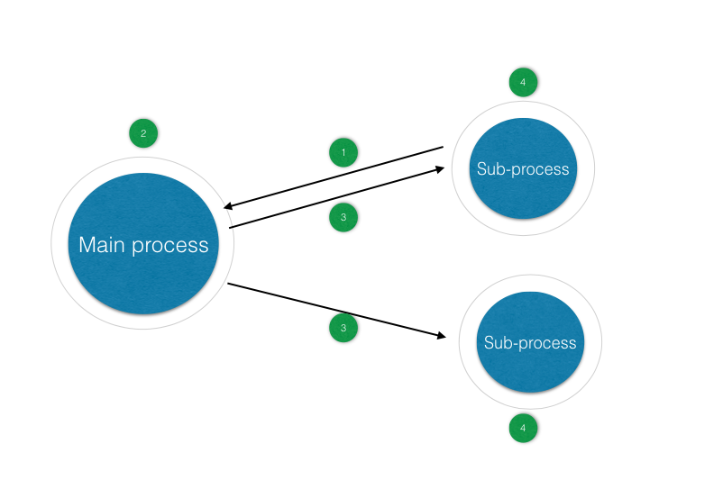

# HermesEventBus

HermesEventBus is a library for using EventBus between processes, useful in the IPC or plugin
development. It provides the same APIs as EventBus and is easy to use.

[Chinese Readme 中文文档](README-zh-CN.md)

[EventBus](https://github.com/greenrobot/EventBus) is one of the most widely-used libraries which
simplifies communication between different components in Android. However, it does not support event
posting between processes.

Therefore, HermesEventBus is composed to support event posting between processes.

Note that HermesEventBus is based on EventBus 3.0.0 and if you are using the earlier version, you should
modify your code. Otherwise you will not receive any event!!!

It is useless to name the method receiving events "onEventXXX". Instead, you should add an @Subscribe
annotation on the method:

```
@Subscribe(threadMode = ThreadMode.MAIN)
public void showText(String text) {
    textView.setText(text);
}
```

#Principle

This library is based on two libraries: [Hermes](https://github.com/Xiaofei-it/Hermes) and
[EventBus](https://github.com/greenrobot/EventBus).

The event posting is based on EventBus. And the IPC is based on Hermes, a smart, novel and easy-to-use
framework for Android Inter-Process Communication (IPC).



This library will choose a process as the main process, and regard the other processes as the
sub-processes.

Each time an event is posted, the library does the following:

1. Use the Hermes library to send the event to the main process.

2. The main process uses EventBus to post the event within the main process.

3. The main process uses the Hermes library to send the event to all of the sub-processes.

4. Each sub-process uses EventBus to post the event within itself.

Furthermore, HermesEventBus uses the [Concurrent-Utils](https://github.com/Xiaofei-it/Concurrent-Utils)
library to solve the subtle problems with respect to concurrency, which are caused by dead locks and race
conditions.

#Usage

This library can be used to post events not only within a single app which has more than one process,
but also between distinct apps.

##Within a single app

If you only need to post and receive events within a single app which has more than one process,
then do the following three steps:

###Step 1

Add the following into your gradle file:

```
dependencies {
    compile 'xiaofei.library:hermes-eventbus:0.3.0'
}
```

For maven, please use the following:

```
<dependency>
  <groupId>xiaofei.library</groupId>
  <artifactId>hermes-eventbus</artifactId>
  <version>0.3.0</version>
  <type>pom</type>
</dependency>
```

###Step 2

In the `Application.onCreate()` method of your application class, add the following statement:

```
HermesEventBus.getDefault().init(this);
```

###Step 3

Each time you use EventBus, replace "EventBus" with "HermesEventBus", as the following does:

```
HermesEventBus.getDefault().register(this);

HermesEventBus.getDefault().post(new Event());
```

HermesEventBus can also post and receive event within a process, so do not use EventBus any more if
you have already being using HermesEventBus.

###Step 4

If a process no longer need to post and receive any event, the process should call the following:


```
HermesEventBus.getDefault().destroy();
```

Otherwise you will have got a `android.os.DeadObjectException` or some other exceptions. However, these exceptions will print some exception messages but will not crash your app.

##Between apps

If you want to post and receive events between apps, then do the following:

###Step 1

Add the following into the gradle file of each app:

```
dependencies {
    compile 'xiaofei.library:hermes-eventbus:0.3.0'
}
```

For maven, please use the following:

```
<dependency>
  <groupId>xiaofei.library</groupId>
  <artifactId>hermes-eventbus</artifactId>
  <version>0.3.0</version>
  <type>pom</type>
</dependency>
```

###Step 2

Choose an app as the main app. You can choose an arbitrary app as the main app, but a long-lived app
is preferred.

In the `AndroidManifest.xml` of the main app, add the service below:

```
<service android:name="xiaofei.library.hermes.HermesService$HermesService0"/>
```

You may also add some attributes to the service, if necessary.

###Step 3

The event posted between apps should have the same package name, the same class name and the same
methods.

And remember to keep all of your event classes and the methods within the classes in the
proguard-rule files.

###Step 4

In the `Application.onCreate()` method of the application class of the main app, add the following statement:

```
HermesEventBus.getDefault().init(this);
```

In the `Application.onCreate()` method of the application class of other apps, add the following statement:

```
HermesEventBus.getDefault().connectApp(this, packageName);
```

The "packageName" is the package name of the main app.

###Step 5

Each time you use EventBus, replace "EventBus" with "HermesEventBus", as the following does:

```
HermesEventBus.getDefault().register(this);

HermesEventBus.getDefault().post(new Event());
```

HermesEventBus can also post and receive event within a process, so do not use EventBus any more if
you have already being using HermesEventBus.


###Step 6

If a process no longer need to post and receive any event, the process should call the following:


```
HermesEventBus.getDefault().destroy();
```

Otherwise you will have got a `android.os.DeadObjectException` or some other exceptions. However, these exceptions will print some exception messages but will not crash your app.

#More open source projects by Xiaofei

Xiaofei's GitHub: [https://github.com/Xiaofei-it](https://github.com/Xiaofei-it)

[Hermes](https://github.com/Xiaofei-it/Hermes) is a smart, novel and easy-to-use framework for
Android Inter-Process Communication (IPC).

[Shelly](https://github.com/Xiaofei-it/Shelly) is a library for business-logic-oriented programming,
providing a novel pattern which uses a method chain to illustrate how each component varies with a
business object.

[AndroidDataStorage](https://github.com/Xiaofei-it/AndroidDataStorage) is an easy-to-use and
high-performance library for storing data in the Android system.

[ComparatorGenerator](https://github.com/Xiaofei-it/ComparatorGenerator) is an easy-to-use helper
class for generating a comparator for a specified class, useful when sorting the instances of the
specified class.

#License

Copyright (C) 2016 Xiaofei, ele.me

HermesEventBus binaries and source code can be used according to the [Apache License, Version 2.0](http://www.apache.org/licenses/LICENSE-2.0.html).
